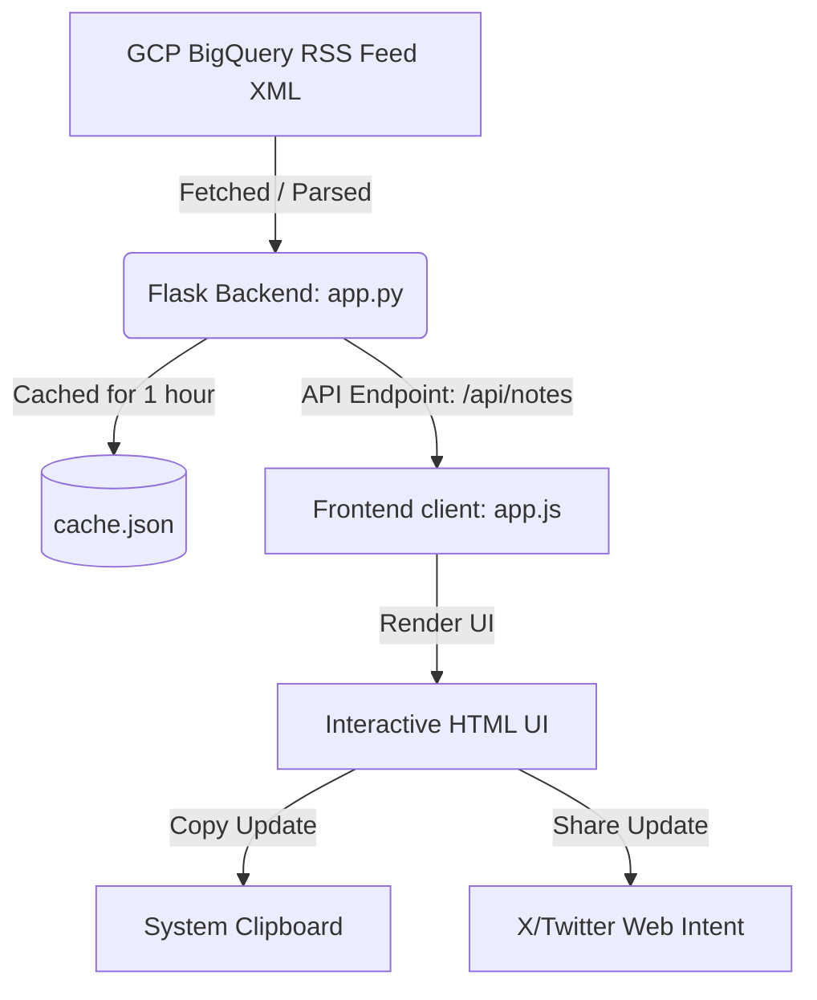

# Implementation Plan: BigQuery Release Notes Tracker

This document details the architecture, design guidelines, UI components, and verification steps for the Google Cloud BigQuery Release Notes Web Application.

---

## 1. System Architecture

The application is structured as a lightweight, single-page web app (SPA) powered by a Python Flask backend.



### Backend (`app.py`)
*   **RSS Parser**: Uses standard library `xml.etree.ElementTree` to parse the Atom feed from `https://docs.cloud.google.com/feeds/bigquery-release-notes.xml`.
*   **Cache Management**: Writes raw feed data to a local `cache.json` file. Subsequent requests within `3600 seconds` (1 hour) read from cache to prevent rate-limiting. A `refresh=true` query parameter bypasses the cache to fetch fresh data.
*   **HTML Sanitizer**: Cleans raw HTML tags using standard regular expressions to prepare plain text summaries for copying and sharing.
*   **API Routes**:
    *   `/`: Serves the static HTML dashboard.
    *   `/api/notes`: Returns structured JSON containing the parsed update feed.

### Frontend (`index.html`, `app.js`, `style.css`)
*   **State Management**: Tracks entries, filtered subsets, active category filters, search keywords, and modal selections.
*   **Event Handling**: Listens for user searches, category filters, copy commands, and tweet shares in real-time.
*   **UI Rendering**: Re-renders the timeline dynamically based on active filter and search text.

---

## 2. Design Aesthetics

To ensure a premium, modern user experience, we employ a curated dark theme with glassmorphic elements and high-contrast Google Cloud-inspired accents.

### Color Palette (CSS Variables)
*   **Background**: Deep Charcoal-blue (`#0b0f19`) and Slate-black (`#0f172a`).
*   **Card Background**: Semi-transparent slate (`rgba(30, 41, 59, 0.7)`) with `backdrop-filter: blur(12px)`.
*   **Border Accents**: Soft slate-cyan borders (`rgba(148, 163, 184, 0.1)`).
*   **Accent Colors (Category Badges & Dots)**:
    *   `Feature` (GCP Blue): `#3b82f6` / `rgb(59, 130, 246)`
    *   `Issue` (GCP Red): `#ef4444` / `rgb(239, 68, 68)`
    *   `Changed` (GCP Yellow): `#f59e0b` / `rgb(245, 158, 11)`
    *   `Deprecation` (Orange): `#f97316` / `rgb(249, 115, 22)`
    *   `Notice` (GCP Green): `#10b981` / `rgb(16, 185, 129)`
*   **Typography**: Google Font **Outfit** (sans-serif) for clean readability and high-tech feel.

### Animations & Transitions
*   **Smooth Hover States**: Cards scale up slightly (`1.01x`) and glow with soft shadows on hover.
*   **Loading State**: A custom circular spinning loader with a pulsing keyframe animation.
*   **Toast Notifications**: Slide in from the bottom-right and fade out after a 3-second delay.

---

## 3. Core Components

### 1. Header (`app-header`)
*   **Logo & Brand**: Contains a database database icon next to the "BigQuery Release Notes Tracker" text.
*   **Cache Indicator Badge**: Displays a static green pill for "Cached" data and blue pill for "Fresh" network updates.
*   **Action Button**: Manual "Refresh" button that triggers a hard network fetch.

### 2. Search & Filter Bar (`filter-section`)
*   **Keyword Search**: Real-time matching against titles, categories, and content text. Includes a clear button (`X`) when text is entered.
*   **Category Buttons**: Round filters displaying badge dots corresponding to each category type.

### 3. Timeline Feed (`notes-feed`)
*   **Timeline Date Headings**: Prominent date markers (e.g., `June 15, 2026`) aligned to a vertical timeline line.
*   **Update Cards**: Styled cards container housing:
    *   Category badges (e.g., `Feature`, `Issue`).
    *   HTML formatted descriptions with active links.
    *   Action icons (Copy to clipboard, Tweet on X).

### 4. X/Twitter Share Modal (`tweet-modal`)
*   **Overlay**: Semi-transparent backdrop to lock body scroll and focus user attention.
*   **Interactive Textarea**: Pre-populated template (`[BigQuery Release - Date] Type: Description Details: Link #BigQuery #GCP`).
*   **Character Counter**: Standard countdown to 280 characters with color changes for warning (`>260`) and disable (`>280`).

---

## 4. Verification and Validation Steps

### Step 1: Backend Sanity Check
Start the Flask app and inspect logs:
```bash
./venv/bin/python app.py
```
Check that it starts without syntax/runtime issues and listens on `http://0.0.0.0:5000`.

### Step 2: API Route Validation
Execute a curl request to verify JSON data payloads:
```bash
curl -s http://127.0.0.1:5000/api/notes | jq .
```
Verify:
*   Status code `200 OK`.
*   Presence of `status: "success"`.
*   Data contains correctly formatted `date`, `updated`, and a list of sub-`updates` with correct categories.

### Step 3: Frontend Feature Verification
*   **Loading State**: Validate that a spinner is visible during fetches.
*   **Filtering**: Select each filter button (`Feature`, `Issue`, etc.) and verify that only cards matching those types are displayed.
*   **Search**: Enter keywords (e.g., `"Gemini"`) to verify instant UI updates.
*   **Copy Button**: Click the copy button on a card and verify the content is saved in the system clipboard.
*   **Tweet Modal**: Click the tweet icon, type some text, check if character count updates, and verify clicking "Post Update" opens a new tab with the pre-filled X intent URL.
